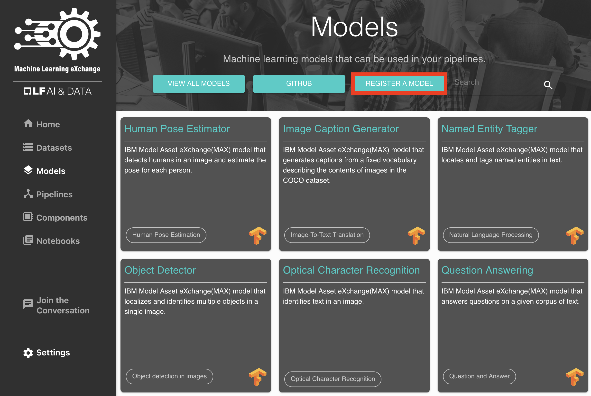
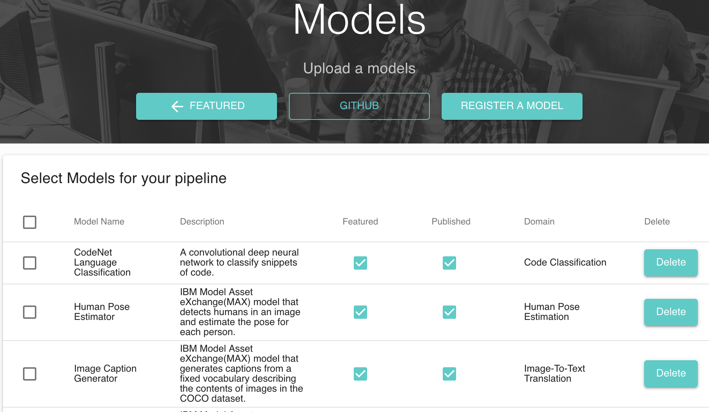
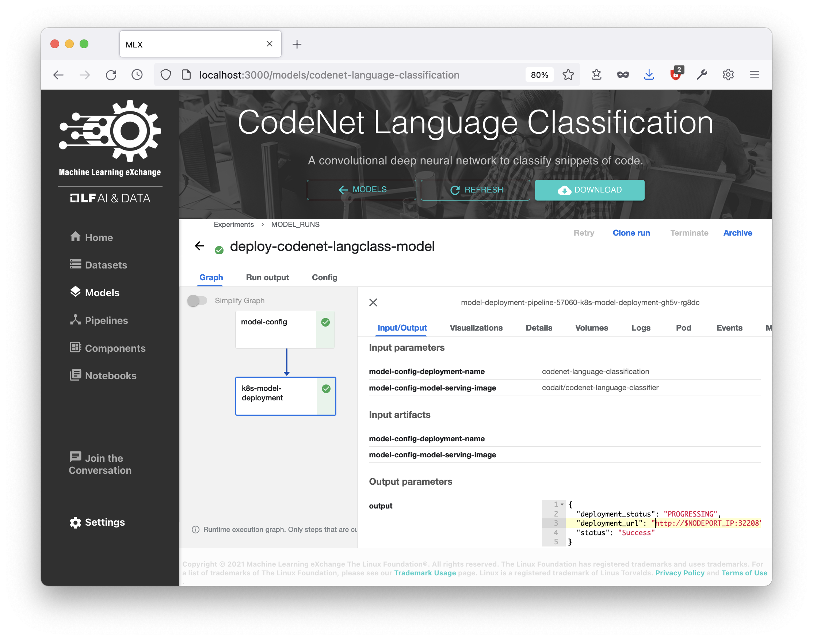

# Workshop - How to Add a New Model to MLX

## Table of Contents

<!-- START of ToC generated by running ./tools/bash/mdtoc.sh docs/mlx-models-workshop.md -->

- [Prerequisites](#prerequisites)
- [Add a New Model to MLX](#add-a-new-model-to-mlx)
  - [Containerize the Model](#containerize-the-model)
  - [Create the Model Metadata (YAML)](#create-the-model-metadata-yaml)
  - [Create a Model README (Optional)](#create-a-model-readme-optional)
  - [Register Model in MLX Catalog](#register-model-in-mlx-catalog)
  - [Publish and Feature the Model](#publish-and-feature-the-model)
  - [Delete a Model](#delete-a-model)
  - [Create `catalog_upload.json` to Upload Multiple Models at Once](#create-catalog_uploadjson-to-upload-multiple-models-at-once)
- [Serve the Model](#serve-the-model)
  - [Launch Model Deployment Pipeline](#launch-model-deployment-pipeline)
  - [Create Route or Port Forward For Inferencing](#create-route-or-port-forward-for-inferencing)
  - [Test the Model](#test-the-model)
  - [Conclusion](#conclusion)


<!-- END of ToC generated by running ./tools/bash/mdtoc.sh docs/mlx-models-workshop.md -->

# Prerequisites

For this workshop you will need access to a Kubernetes cluster with MLX deployed,
or a local deployment of MLX on KIND (Kubernetes in Docker). The Quickstart with
Docker Compose allows uploading and deleting models, but it does not support
serving models using Kubeflow Pipelines.

- [Deploy MLX on a Kubernetes cluster](mlx-setup.md)
- [Deploy MLX locally on KIND](install-mlx-on-kind.md)

There are only minor differences in how to navigate the Kubernetes resources
depending on the selected deployment option, with the most notable difference
being the host and port of the MLX (UI) server.

For this workshop we assume a single-user [MLX deployment on OpenShift (on Fyre)](http://mlx.apps.mlx-test-4.cp.fyre.ibm.com/).

    http://mlx.apps.mlx-test-4.cp.fyre.ibm.com/

<!-- TODO: remove the URL above -->


You need to be logged in as an `admin` user in order to register and deploy models.

# Add a New Model to MLX

## Containerize the Model

Most of the sample models in the MLX catalog are from IBM Model Asset Exchange (MAX) which
was sunset early 2022. The model files are hosted on IBM Cloud Object Storage.
The code to deploy the model as a web service in a Docker container can be found in their
respective [Github repositories](https://github.com/orgs/IBM/repositories?q=%22MAX-%22&type=all&language=&sort=name)
i.e. [CodeNet-Language-Classification](https://github.com/CODAIT/MAX-CodeNet-Language-Classification)
A detailed guide on how to create a Flask app to wrap the model along with a Swagger 
API user interface can be found in this
[step-by-step guide](https://github.com/IBM/MAX-skeleton#step-by-step-guide-to-wrapping-a-model)


## Create the Model Metadata (YAML)

The model metadata has required fields to display the model in the MLX UI as well as optional fields which determine what
can be done with the model, i.e.

```YAML
name: "CodeNet Language Classifier"
model_identifier: "codenet-language-classification"
description: "A convolutional deep neural network to classify snippets of code"
framework:
  name: "TensorFlow"
  version: "2.5"

license: "Apache 2.0"
domain: "Code Classification"
website: "https://github.com/CODAIT/MAX-CodeNet-Language-Classification"

serve:
  servable: true
  tested_platforms:
    - kubernetes
    - kfserving
  serving_container_image:
    container_image_url: "codait/codenet-language-classifier"

readme_url: "https://raw.githubusercontent.com/machine-learning-exchange/katalog/main/model-samples/codenet-language-classification/codenet-language-classification.md"
```

A detailed description of how to create model metadata (YAML) for either training or serving
can be found here [models/README.md](/models/README.md#create-model-metadata)

## Create a Model README (Optional)

Each model can have a Github-flavored markdown (`.md`) file which will be rendered
in the MLX UI. If no `readme_url` is specified in the model's YAML file, a general
overview is created from the contents of the YAML file. Examples can be found in
the [MLX Katalog repo](https://github.com/machine-learning-exchange/katalog/tree/main/model-samples)
i.e. the [Codenet README](https://github.com/machine-learning-exchange/katalog/blob/main/model-samples/codenet-language-classification/codenet-language-classification.md)

## Register Model in MLX Catalog

The model metadata YAML file can be uploaded from a local file or by providing a
raw url to a README.md file in a Github repository.



1. Click on the "Models" link in left-hand navigation panel
2. Click on "Register a Model"
3. Click on the "Browse" button to select a YAML file or provide a URL to download the YAML file
    * `.tar.gz` and `.tgz` files containing the compressed
      `.yaml` specification can also be uploaded
4. Enter a name for the model; Otherwise the name from the YAML file will be used


More details can be found [here](/models/README.md#register-a-model)


## Publish and Feature the Model

When a new model is uploaded, it is automatically "featured" on the main Models
page. In order to remove (or add models back) to the featured page, click on the
**View all Models** button and select/unselect the respective check boxes.



## Delete a Model

The **View all Models** page can also be used to remove models from the MLX catalog.

## Create `catalog_upload.json` to Upload Multiple Models at Once

MLX supports uploading multiple catalog assets at once ("bulk"-upload) as described
in this [guide](/docs/import-assets.md).


Take a look at the `catalog_upload.json` file under [MLX Bootstrapper](/bootstrapper/catalog_upload.json)

```JSON
{
  "models": [
    {
      "name": "CodeNet Language Classification",
      "url": "https://raw.githubusercontent.com/machine-learning-exchange/katalog/main/model-samples/codenet-language-classification/codenet-language-classification.yaml"
    },
    {
      "name": "Human Pose Estimator",
      "url": "https://raw.githubusercontent.com/machine-learning-exchange/katalog/main/model-samples/max-human-pose-estimator/max-human-pose-estimator.yaml"
    },
    {
      "name": "Image Caption Generator",
      "url": "https://raw.githubusercontent.com/machine-learning-exchange/katalog/main/model-samples/max-image-caption-generator/max-image-caption-generator.yaml"
    }
  ]
}
```


# Serve the Model

Models can easily be trained or served using Kubeflow Pipelines depending on the
`train` or `serve` metadata specified in the YAML file.

More details can be found [here](/models/README.md#serve-the-model) and in this
[MLX Workshop](mlx-workshop.md#serve-the-model) using the Codenet Language
Classification model as an example.


## Launch Model Deployment Pipeline

Models that have the `serve` specification can be deployed directly from the MLX UI:

1. Under the models tab, select a model
2. Switch to the "LAUNCH" tab
3. Optionally, give the pipeline run a name
4. Click submit to run the pipeline which will deploy the model

We have created a containerized version of the **CodeNet Language Classification**
model that can be deployed on Kubernetes to allow inferencing via `curl`, or,
directly from a web browser using a simple Swagger UI to the inferencing service.  


Click on the **Models** menu item and select the **CodeNet Language Classification**
model.

* The **DESCRIPTION** tab shows the details of the model with links to the original
  dataset
* The **LAUNCH** tab allows users to (train or) serve the model on Kubernetes
* The **YAML DEFINITION** tab shows the metadata required by MLX
* The **SAMPLE SERVING CODE** tab displays a generated sample pipeline to serve
  the model


Click on the **LAUNCH** tab to start the pipeline run to serve the model
* The **Launch Type** is `Serving`
* The **Platform** is `Kubernetes`
* Enter a **Run Name** or leave the default
* Click **SUBMIT** to start the pipeline run



Now the Kubeflow Pipeline run view should appear, and get updated as the pipeline
execution progresses. You can click on the task in the pipeline graph and follow
the **Logs**. Once the second step of the pipeline is completed, you can find the
name of the deployed model "`codenet-language-classification`".


## Create Route or Port Forward For Inferencing

Once a model has been deployed for inferencing, it has to be made available via
a local port forwarding or a OpenShift Route.


For MLX on KIND we need to make the port available on localhost by running the
following command:

```Bash
kubectl wait --for=condition=ready pod -l app=codenet-language-classification && \
  kubectl port-forward svc/codenet-language-classification 5000:5000
```

Now we should be able to access the UI page for the deployed model by pasting
`localhost:5000` into our browser's address bar:

```
http://localhost:5000/
```


## Test the Model

Expand the first section called **model** and click on **POST /model/predict**
and the click on the **Try it out** button on the very right of the **Parameters**
line.


In order to test the classification model, we need to provide a source code file
in any of the 10 supported languages like C/C++, Java, JavaScript or Python.
You could either use a source file from one of your local projects or download
the [CodeNet Sample Dataset for Language Classification](https://dax-cdn.cdn.appdomain.cloud/dax-project-codenet/1.0.0/Project_CodeNet_LangClass.tar.gz)
and extract it to a local folder.

On the model prediction input dialog, click **Browse** and select a source
file


Now click **Execute** to get the model's prediction.

The Response should look similar to this:

**Response body**

    {
      "status": "ok",
      "predictions": [
        {
          "language": "Haskell",
          "probability": 0.9999926090240479
        }
      ]
    }


## Conclusion

In this workshop we demonstrated how to use MLX to register a model to the MLX 
catalog and how MLX can be used to deploy pretrained containerized models on
Kubernetes.

For comments, suggestions or bug reports, please do to 
https://github.com/machine-learning-exchange/mlx/issues
